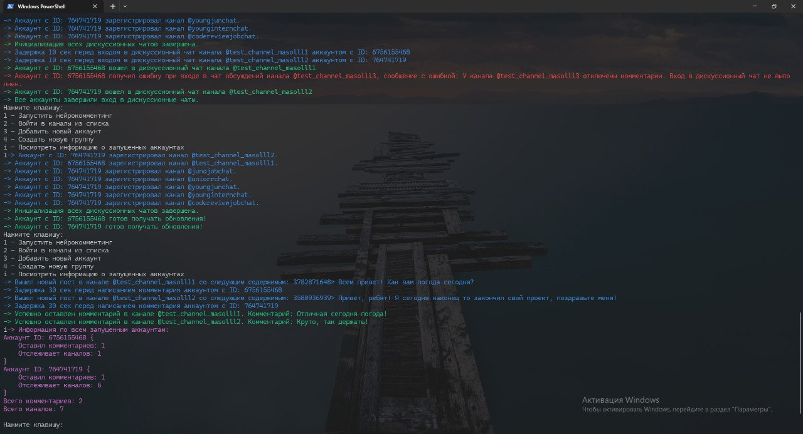

# Telegram Neurocommenting Script

---
## ✨ Overview

Console-based Telegram neurocommenting script written in C# (.NET).

Neurocommenting is an automated approach to generating and posting context-aware comments under Telegram channel posts using AI language models.  
It is commonly used for traffic attraction, audience engagement, and marketing promotion by increasing visibility and interaction in comment sections.

This application supports multiple Telegram accounts, account groups, optional proxy usage, and asynchronous processing for receiving updates and posting comments.

> ⚠️ Note: The console interface and interactive prompts are currently available in Russian only.

---

## 💡 Key Features

- Multi-account Telegram client support (user accounts, not Bot API)
- Account grouping with shared configuration
- Automated AI-powered comment generation using the API [IONet](https://io.net)
- Asynchronous processing of Telegram updates and new posts
- Additional proxy support for group accounts and sending requests to API [IONet](https://io.net)
- Centralized configuration using JSON files
- Console-based interactive command system
- Thread-safe handling of shared resources
- Modular architecture with clear separation of responsibilities

---

## 🗃️ Project Structure
```
Src/                # Application source code
│
├── Command/         # Command pattern implementation (CLI actions)
├── Telegram/        # Telegram client logic and update handling
├── Channels/        # Channels storage and access logic
├── Settings/        # Application, group, and account configuration models
├── Infrastructure/  # File system, logging, paths, proxy, and console utilities
├── IONet/           # Networking and AI-related HTTP logic
├── Program.cs       # Entry point
│
Data/               
└──Config/          # User-editable configuration files
```

### 📂 Data Folders

- `Data/Config/` (inside the project)  
  Contains initial configuration files: 
   - `Settings.json` - general script settings
   - `Channels.txt` - list of public channels to join
   - `Prompt.txt` - prompt for AI


- `Data/` (next to the executable)  
  Created automatically at runtime.  
  Contains:
    - `Config/` — copy of `/Data/Config` from the project root
    - `Accounts/` — Telegram accounts and group data
    - `Logs/` — runtime log files
---

## ⚙️ Configuration

- ### 💬 Channels.txt
  - The Data/Config/Channels.txt file stores links to Telegram public channels you need to join. Each link starts on a new line. The link format is `https://t.me/some_channel_1` or `@some_channel_1`.

- ### 🧠 Prompt.txt
  - The Data/Config/Prompt.txt file contains the prompt for the AI model, which is sent each time along with the comment text.

- ### 📄 Settings.json
  - The Data/Config/Settings.json file contains general script settings.

| Parameter                                        | Description                                                                                                                                                            |
|--------------------------------------------------|------------------------------------------------------------------------------------------------------------------------------------------------------------------------|
| `PromptTone` | Tone of the comment (positive, humorous, etc.)                                                                                                                         |
| `MinWordsInPost`               | Minimum number of words in a post, otherwise the post will be skipped                                                                                                  |
| `AccountCommentsLimit`               | The comment limit after which a delay will follow `DelayAfterCommentsLimit`                                                                                            |
| `AccountChannelsJoinLimit`                | The maximum number of channels each account can join                                                                                                                   |
| `DelayAfterCommentsLimit`                                    | Wait in seconds after reaching `AccountCommentsLimit`                                                                                                                  |
| `DelayBeforeJoin`                                   | Wait in seconds before joining the channel                                                                                                                             |
| `DelayBeforeCommenting`                                 | Wait in seconds before commenting on a new post                                                                                                                        |
| `SkipPostsBeforeCommenting` | The number of posts to skip before commenting on a new post.                                                                                                           |
| `IONetApiKey`               | API key [IONet](https://io.net/) for generating comments                                                                                                               |
| `ProxyForIONet`               | Socks5 proxy for sending requests to IONet. The `Enabled` flag allows you to disable the proxy.                                                                        |
| `AiModels`                | A collection of prioritized AI models. When a model reaches its request limit, the next highest-priority model is used. The lower the number, the higher the priority. |

---

## 🛠️ Pre-requisites
- .NET 9 SDK (for building and running the application)
- Telegram account(s) for commenting
- Optional: Proxy server if you want to use groups or API io.net with proxies

---

## 🚀 Quick Start

### 1. Clone this repository
```bash
git clone https://github.com/Masolll/Neurocommenting.git
```

### 2. Create an io.net API key
- Go to [IONet](https://ai.io.net/ai/api-keys) to generate an API key.

### 3. Modify the Settings.json file.

- You can leave the default configuration or customize it as needed.

- ⚠️ Be sure to change the IONetApiKey parameter. Without it, comment generation will not work.

### 4. Modify the Channels.txt (Optional)
- If you are going to join new public channels, be sure to edit the Channels.txt file.

### 5. Modify the Prompt.txt (Optional)
- If you are not satisfied with the standard prompt, you can change it.

### 6. Run script
```bash
dotnet run
```
### Example of work screenshot



---

## 🔧 Usage / How It Works

When you start the program, you will see the following menu:


### 🕹️ Supported Modes

1. Start Neurocommenting Mode.
   - This is the script's primary mode of operation.
     Accounts monitor new messages in discussion chats they already belong to and comment on. 
   - > ⚠️ A discussion chat is a chat associated with a channel where comments on messages are posted.

2. Join Channels Mode.
   - In this mode, accounts automatically join discussion chats in the channels specified in the Channels.txt file.
    This step is typically performed before launching neuroannotation.
   - > ⚠️ Accounts are only join in discussion chats! Subscriptions to channels from Channels.txt do not work.

3. Add New Account Mode.
   - In this mode, you can add a new account to any group. The account's folder will be located within the specified group and named `Account(<Account_Id>)`.


4. Create New Group Mode.
    - In this mode, you can create a new group for accounts. A group is a folder containing accounts that work under the same proxy. Group will be named `Group(<ProxyIp_ProxyPort>)`.
    - > ⚠️ Each group must have a unique proxy. It is not possible to create multiple groups with the same proxy!

5. Runtime Information Mode.
   - While the script is running, the user can request information about the current status of the accounts using a CLI command `'i'`.

### ⏳ Application Lifecycle

Modes keep the application running indefinitely to handle Telegram updates in real time.
The program can be safely stopped by closing the console or interrupting execution.

---

## 🏗️ Technical Stack
- ### 📌 Core Technologies
  - .NET 9.0 — main application runtime and CLI environment
  - C# — primary programming language
  - [WTelegramClient](https://github.com/wiz0u/WTelegramClient) — library for working with Telegram API

- ### 🤖 AI Technologies
  - [IONet](https://io.net/) API - free comment generation using AI.

- ### 🌐 Networking
  - [StarkSoftProxy](https://www.nuget.org/packages/StarkSoftProxy/) - library for working with proxies Socks5 for accounts groups.
  - WebProxy (System.Net) - library for working with proxies Socks5 for IONet API.

---

## 📄 Legal & Usage Notes

This project is distributed under the MIT License.

This software is provided "as is", without any warranties.
The author is not responsible for account bans, financial losses,
or misuse of the software.

The project is intended for educational and research purposes.
Use it responsibly and in compliance with Telegram’s terms of service.